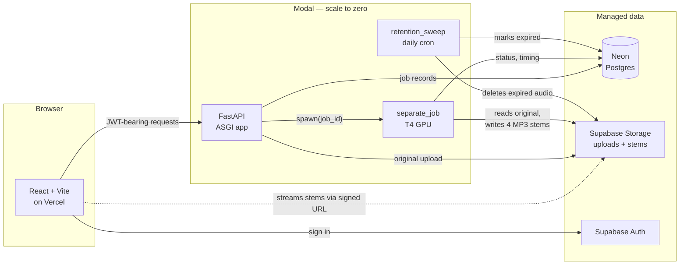
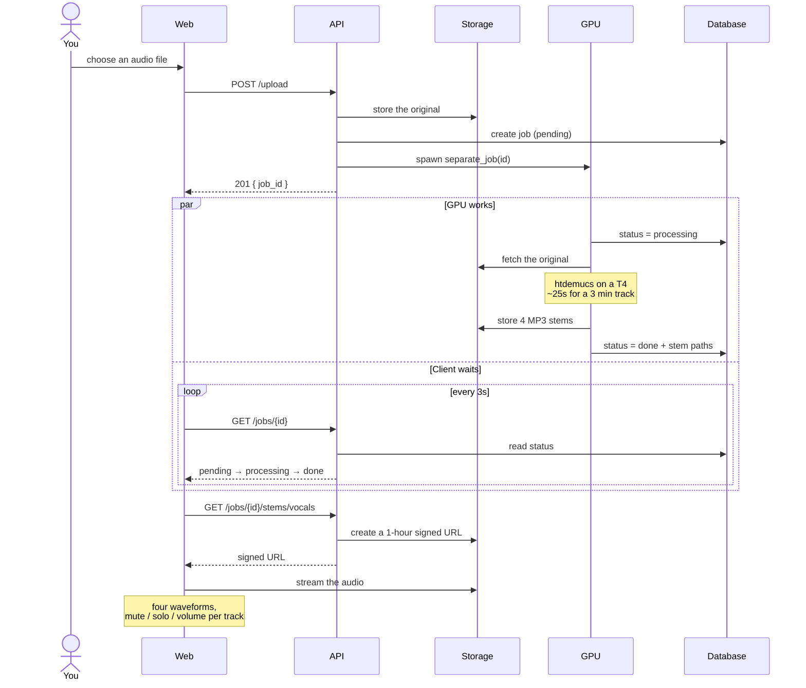

# TrackSplit

AI-powered music backing track generator. Upload a song, separate it into stems (vocals, drums, bass, other), and create custom mixes for practice.

**[Try it without signing up →](https://music-tool-web.vercel.app/demo)** — a real separation you can mute, solo and mix in the browser.

> **[DECISIONS.md](DECISIONS.md)** — why this stack, what was rejected, and what each choice costs.
> **[RUNBOOK.md](RUNBOOK.md)** — service dashboards, credential provenance, cold-start steps, deployment status.

## How it works

You upload a song. A GPU pulls it apart into four independent tracks — vocals, drums, bass, and everything else — and hands them back as a mixing desk in the browser. Mute the vocals to sing over the band; solo the bass to learn a line; drop the drums and play along yourself. Export whatever mix you land on.

The separation is done by [Demucs](https://github.com/adefossez/demucs), a machine-learning model that reconstructs each instrument as its own audio stream rather than filtering frequency bands. It needs a GPU to be quick: the same job takes ~25 seconds on a T4 and ~12 minutes on a laptop CPU.

Everything runs on free tiers and scales to zero, so an idle month costs nothing.

### Architecture



The API never does heavy work itself. It validates, stores, and spawns — then the GPU function owns the whole job, including writing the final status. That is why the client can just poll the database and never needs to know which executor ran it.

### A separation, end to end



Two details that shape the design. Separation is dispatched rather than awaited, because a request cannot stay open for the length of a GPU job — so job state lives in Postgres and the client polls it. And stems are served as short-lived signed URLs rather than public files, so the storage buckets stay private.

## Prerequisites

- Node.js 20.x (do not use 20.19+ — Vite 5 requires exactly 20.18 or lower)
- Python 3.11+
- ffmpeg on PATH (`winget install Gyan.FFmpeg`) — `pydub` needs it for export and MP3 transcoding
- A free [Supabase](https://supabase.com) project with two storage buckets: `uploads` and `stems`
- A free [Neon](https://console.neon.tech) Postgres database
- A free [Modal](https://modal.com) account — runs both the API and GPU separation
- Docker Desktop is **optional**, only if you want a local Postgres instead of Neon

## First-time setup

### 1. Clone and install

```bash
git clone <repo-url>
cd tracksplit
npm install
```

### 2. Start local Postgres (optional)

```bash
docker compose up -d
```

Only needed if you'd rather not point `DATABASE_URL` at Neon. There is no Redis
any more — the job queue is Modal.

### 3. Backend environment

```bash
cd apps/api
cp .env.example .env
```

Edit `apps/api/.env` and fill in your Supabase credentials:

```
SUPABASE_URL=https://<your-project-ref>.supabase.co
SUPABASE_SERVICE_ROLE_KEY=<your-service-role-key>
```

Get these from your Supabase project: **Settings → API → Service role key**.

The `uploads` and `stems` buckets must already exist in Supabase Storage before starting the API.

### 4. Backend dependencies

```bash
cd apps/api
python -m venv .venv

# Windows
.venv\Scripts\activate

# macOS / Linux
source .venv/bin/activate

pip install -e .
```

### 5. Run database migrations

```bash
cd apps/api
alembic upgrade head
```

## Running the app

Two processes — open two terminals.

**Terminal 1 — Frontend**
```bash
npm run dev:web
```

**Terminal 2 — API server**
```bash
cd apps/api
uvicorn main:app --reload
```

There is no worker process. With `MODAL_TOKEN_ID` set, uploads are dispatched to
Modal's GPU and finish in ~25 seconds. Without it, separation runs in-process as
a background task on your CPU, which takes ~12 minutes per track.

### Verify

- Frontend: http://localhost:5173
- Backend health: http://localhost:8000/health → `{"status":"ok"}`
- API docs: http://localhost:8000/docs

## Troubleshooting

### Uploads not reaching the API / Supabase not populating

On Windows, closing a terminal does not always kill the uvicorn process. A lingering process on port 8000 will silently intercept all requests while the new server sits idle.

Check and kill any leftover processes:

```powershell
# See what's on port 8000
Get-NetTCPConnection -LocalPort 8000 -State Listen | Select-Object LocalAddress, OwningProcess

# Kill it
Stop-Process -Id <OwningProcess> -Force

# Or kill all Python processes at once
Get-Process python | Stop-Process -Force
```

Then restart uvicorn. Confirm it's receiving requests by checking that `POST /upload` appears in the terminal after an upload.

### Jobs stuck in "processing" / stems never appear

Check the `tracksplit-separation` logs at [modal.com/apps](https://modal.com/apps).
A common cause is that the separation app was never deployed — `workers/dispatch.py`
resolves the function by name at runtime, so a missing deploy fails only once a
job actually runs, not at API startup.

### Old jobs (pre-Supabase) fail after migration

Jobs created before the cloud-storage change store local file paths in the database. The new worker tries to fetch those paths from Supabase and will fail. This is expected — only jobs created after the migration work end-to-end.

## Project Structure

```
tracksplit/
├── apps/
│   ├── web/               # React + TypeScript frontend (Vite)
│   │   └── src/
│   │       ├── features/
│   │       │   ├── upload/
│   │       │   ├── mixer/
│   │       │   ├── waveform/
│   │       │   ├── export/
│   │       │   └── demo/     # public, no sign-in
│   │       └── lib/       # Shared utilities (api.ts, etc.)
│   └── api/               # Python FastAPI backend
│       ├── main.py
│       ├── routes/
│       ├── services/
│       ├── workers/
│       ├── audio/
│       ├── storage/       # Supabase storage client
│       ├── models/
│       └── alembic/       # Database migrations
├── docker-compose.yml     # Optional local PostgreSQL (no Redis — the queue is Modal)
├── .env.example
└── README.md
```

## Deployment (backend on Modal)

The backend runs on [Modal](https://modal.com), which hosts both the API and the
GPU separation function and scales to zero when idle. On Modal's free Starter
plan ($30/month of credits) this costs nothing at portfolio traffic levels.

### 1. Authenticate

```bash
cd apps/api
.venv/Scripts/modal.exe token new   # opens a browser
```

### 2. Create the secret

Production config comes from a Modal secret named `tracksplit`, not from a
`.env` file. It must contain `DATABASE_URL`, `SUPABASE_URL`,
`SUPABASE_SERVICE_ROLE_KEY`, `SUPABASE_ANON_KEY`, `SECRET_KEY` and
`CORS_ORIGINS` — the app refuses to deploy if any are missing.

```bash
modal secret create tracksplit --from-dotenv <a file holding only those six keys>
```

Don't feed it `apps/api/.env` wholesale: that would hand Modal its own
`MODAL_TOKEN_SECRET`, which the API has no reason to hold.

### 3. Deploy both apps

```bash
cd apps/api
modal deploy modal_app.py          # the FastAPI app + migrate()
modal deploy modal_separation.py   # the T4 GPU separation function
```

### 4. Migrate

Migrations are an explicit step, deliberately outside the request path — running
them at app startup would race whenever Modal starts more than one container.

```bash
modal run modal_app.py::migrate
```

### 5. Smoke test

`GET https://<your-workspace>--tracksplit-api-fastapi-app.modal.run/health` → `{"status":"ok"}`

Expect ~6s on a cold start and well under a second warm.

## Notes

- The frontend reads `VITE_API_BASE_URL` from `.env` — must be prefixed `VITE_` for Vite to expose it client-side. Defaults to `http://localhost:8000`.
- CORS origins are driven by the `CORS_ORIGINS` env var (comma-separated). Falls back to `http://localhost:5173` for local dev. In production it comes from the Modal secret, so changing it means recreating the secret and redeploying.
- Never commit `.env` files — they are gitignored.
- Stem separation takes ~25 seconds on Modal's T4. On a local CPU it is ~12 minutes, and the job shows as `processing` throughout.
- `workers/dispatch.py` resolves the Modal function **by name** at runtime, so deploying the API without the separation app fails only when a job runs.
